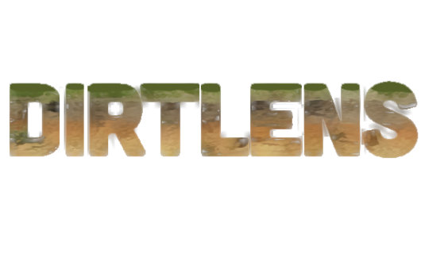

DirtLENS documents soil and geological material using a light chambered boroscope, enabling accurate data collection in the majority of soil sciences. Combining computer vision and GPS, DirtLENS effortlessly identifies color and other properties of samples, offering insights into stratified soil and its geologic context.

Ongoing development in texture and granularity recognition, will further enhance its applicability. With an intuitive, jargon-free interface, DirtLENS suits both professionals and non-experts.
